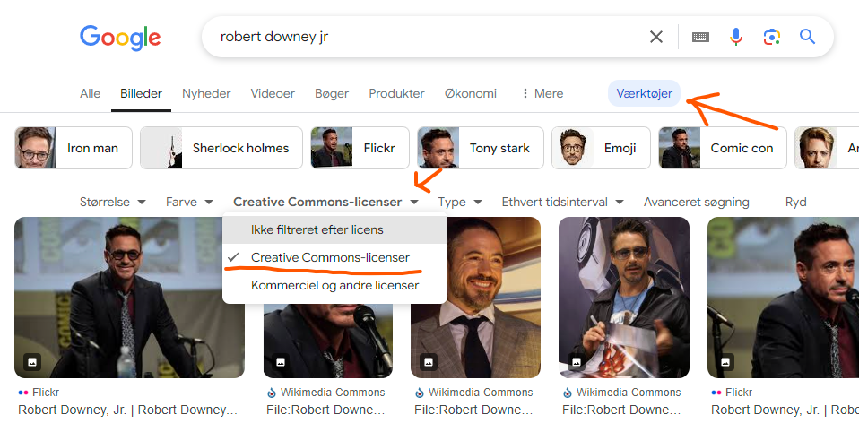
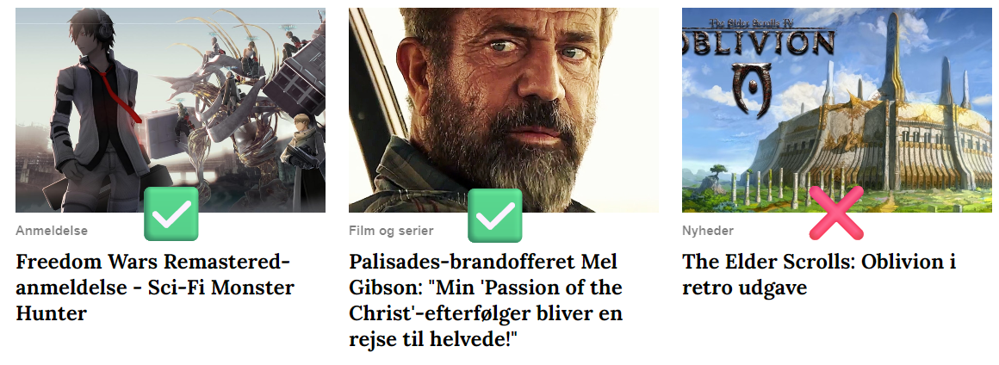
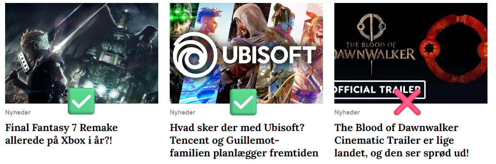
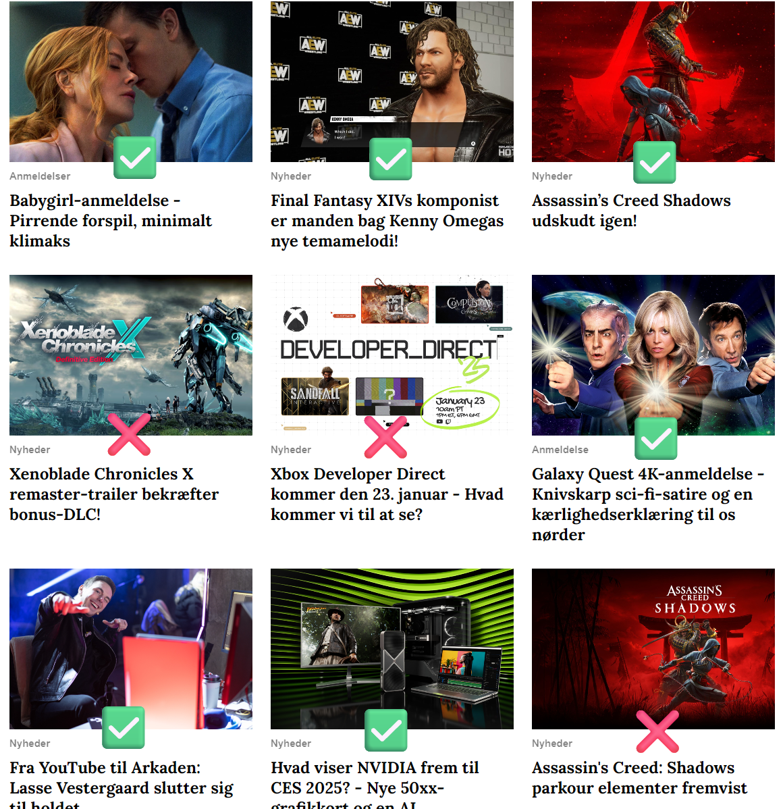

Alle artikler skal have et billede tilknyttet. Det kan være en hård nød at knække, for billedet skal være trækplaster på forsiden - dét, der får læseren til at klikke. Derfor er det nødvendigt at bruge lidt tid og omtanke på at finde et fedt billede til din tekst. Det skal denne guide hjælpe med.  

Guiden gennemgår disse ting:  

- Hvilke billeder må vi bruge?
- Hvor finder man billeder?
- Hvad er et godt cover-billede?

## Hvilke billeder må vi bruge?
Vi er et kommercielt foretagende. Der er penge i spil. Derfor skal vi være *meget* skarpe på, om vi rent faktisk har lov til at bruge de billeder, vi lægger op.  

Rigtig mange mennesker har fået den opfattelse, at hvis et billede ligger på nettet, må man bare bruge det. **Sådan er det ikke**. Medmindre du selv har stået med kameraet, skal vi helt firkantet i princippet have fået lov til at bruge hvert eneste billede vi bringer.  

I praksis kan vi selvfølgelig ikke skrive eller ringe rundt til alle fotografer og grafikere i verden og spørge om lov. I stedet må vi nøjes med at bruge billeder, hvor ophavsfolkene har givet os lov i forvejen. Dem er der heldigvis mange af.  

Vi kan i god tro formode, at der er givet lov til at bruge

- ✅ Screenshots og artwork fra spil
- ✅ Still-billeder og promo-billeder fra film, som filmselskabet selv har udsendt.
- ✅ Udsnit af biografplakater / filmæske-forsider / spilæske-forsider

Når vi skal skrive om offentlige personer, bliver det straks mere kringlet. Skriver man om en skuespiller eller en filminstruktør, kan man som regel finde et promo-billede fra deres seneste film. Men hvad med forretningsfolk? Direktører eller politikere? Her er der sjældent "officielle" billeder, vi kan låne. Og vi må *ikke* tage billeder fra andre medier.  

Heldigvis findes der en lang række af gavmilde fotografer ude i verden, der lægger deres billeder ud til fri afbenyttelse, og **udtrykkeligt skriver** at alle må bruge dem.  

Disse billeder er lette at finde med Google Image Search. På siden med søgeresultater trykker du på "Værktøjer", trykker herefter "Brugsrettigheder" og vælger "Creative Commons-licenser".  

Det er vigtigt trykke igennem til det faktiske billede, og lige tjekke efter at Google ikke har fået brugsrettighederne galt i halsen. Kig efter udtryk som "public domain" eller "creative commons". Står der "non-commercial", må vi **ikke** bruge billedet.  

Ofte kan man også se, hvordan fotografen evt. gerne vil krediteres.  

#### Hvilke billeder må vi *ikke* bruge?

Vi kan komme alvorligt i klemme, hvis vi bruger billeder, vi ikke har fået tilladelse til. Det gælder især billeder taget fra røde løbere, prisuddelinger, koncerter m.m. Kort sagt, alle billeder taget af en professionel fotograf eller fotojournalist, der arbejder for et medie, et billedbureau, eller på anden måde lever af at sælge disse billeder videre.  

Hvis billederne stammer fra nogle af disse steder, skal du holde dig langt, langt væk:  

- ❌ ScanPix
- ❌ Ritzau
- ❌ Getty Images
- ❌ All Over Press
- ❌ Associated Press
- ❌ Reuters

Listen er ikke komplet, så tænk dig godt om. Og spørg gerne i vores chats, hvis du er i tvivl - hellere en gang for meget end for lidt.  
## Hvor finder man billeder?

Som nævnt før, er Googles billedsøgning en god kilde, når du skal finde billeder til frit brug.  

Screenshots fra spil kan nemmest findes på de digitaler butikker, der sælger spillene. Både  [Nintendo eShop](https://www.nintendo.com/en-gb/Nintendo-eShop/Nintendo-eShop-1806894.html?red_source=eshop.nintendo.co.uk&redirect=true) og [Steam](https://store.steampowered.com/) er gode. Butikkerne til Xbox og PlayStation er til gengæld skrald på dette punkt.  

Find det pågældende spil, tjek galleriet og vælg et eller flere gode billeder. Åben gerne billederne i en ny fane hver for sig, inden du gemmer dem - på den måde kan du tjekke, at du faktisk har fat i den rigtige fil, med den fulde opløsning, og ikke bare en lille thumbnail.  

Billeder fra film findes nemmest på [IMDB](https://www.imdb.com/). **Bemærk!** IMDB har ofte også billeder fra prisuddelinger, gallapræmierer og den slags - disse kan vi som regel *ikke* bruge, da de oftest kommer fra billedbureauer som Getty Images.  

## Hvad er et godt cover-billede?
Et ideelt cover-billede opfylder alle disse kriterier. Det kan ikke altid lykkes, og nogle gange må man gå på kompromis. Men gør dit bedste for at nå dem alle.  

Et godt cover-billede 

- ✅ har et klart motiv
- ✅ har klare og kontrastfulde farver
- ✅ er nemt at aflæse, også når det er lille
- ✅ har ingen tekst på sig

Et klart motiv kan både være en person, en figur, en genstand eller andet. Det skal bare være tydeligt, hvad der er i fokus.  

Klare og kontrastfulde farver giver blikfang. Et billede med mudrede eller kun mørke farver ligner lort. Det kan være helt fint at bruge billeder i sort/hvid - bare der er god kontrast og motivet er tydeligt.  

Forsidebilleder kan både blive vist i stort format øverst på siden, og som en lille thumbnail længere nede. Billedet skal fungere begge steder. Derfor må det ikke være for rodet - billeder fra spil kan desværre være slemme i den sammenhæng. Så når du leder efter billeder, så hold gerne øje med hvordan thumbnail'ene ser ud. Kan du se hvad billedet forestiller i mini-format? Hvis ikke, så find et andet.  

Tekst på billeder oftest noget lort. Dels giver det tit dobbeltkonfekt i forhold til overskriften. Dels bliver dele af teksten tit skåret af, når WordPress justerer billedet til brug på forsiden. Og dels er et stort, tykt logo sjældent særligt spændende at se på. Prøv så vidt muligt at finde billeder, der ikke har tekst.  

**Hvad hvis nyheden handler om et firma og ikke et produkt?** Et firmalogo ser sjældent særligt spændende ud. Ofte er det bedre at vælge et billede af et spil eller produkt, som firmaet er særligt kendt for - Mario til en nyhed om Nintendo, Kratos eller en PlayStation til en nyhed om Sony. Hvis du har lidt grafisk snilde og kan sætte en fed collage sammen, kan det også være et hit. Og prøv ellers så vidt som muligt at finde nogle interessante produktbilleder.  

### Eksempler

Det første billede er godt, det andet billede er suverænt. Tredje billede er et fint eksempel på, hvorfor tekst på billeder er skidt.  

Første billede er godt. Andet billede har tekst, men det er som element i en fin collage og fungerer glimrende i dette tilfælde. Tredje billede er nærmest ren tekst og et uigenkendeligt logo, det ser elendigt ud.  

Her kommer en stribe eksempler mere. Jeg vil ikke kommentere på dem alle, men bemærk især de to billeder fra Assassin's Creed: Shadows, hvor det ene er uden tekst, og det andet er med. Det første fungerer *langt* bedre.  

