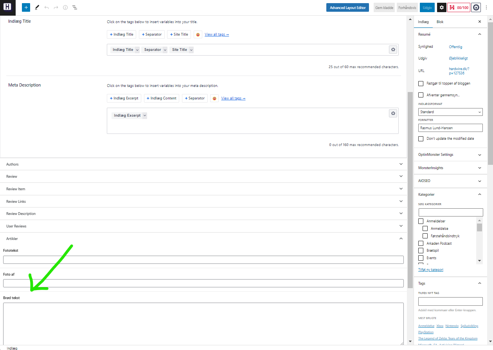
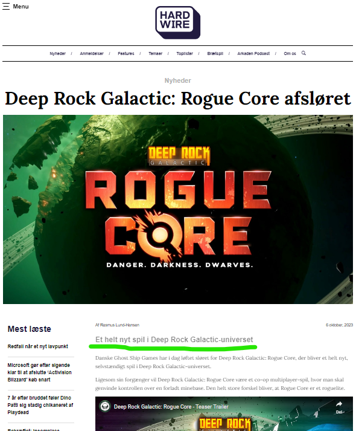
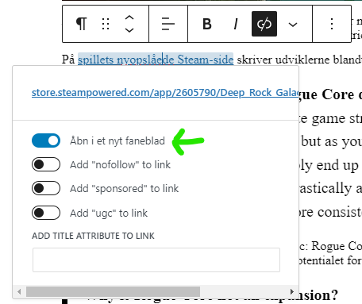
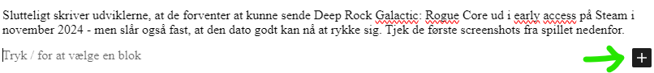
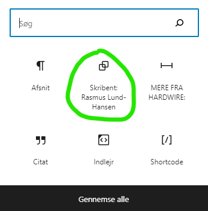
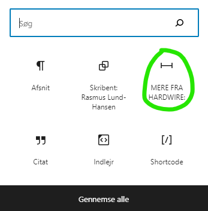
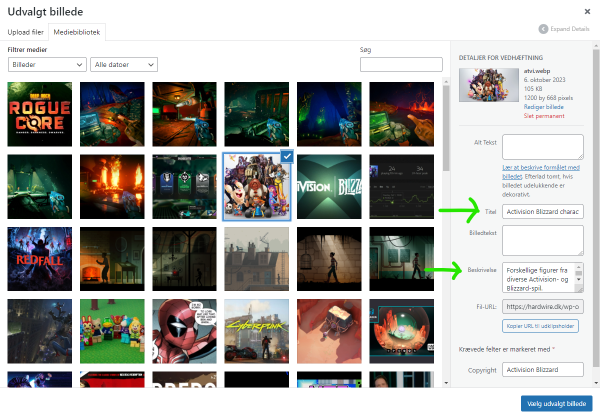
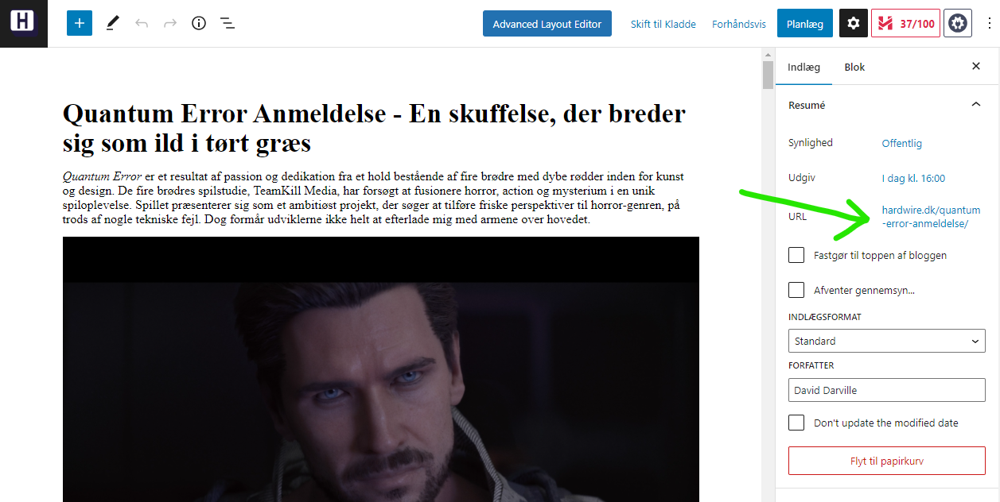

*[Tilbage til forsiden](index.html)*

# Tjekliste til når du tilføjer nyheder/artikler til siden
*Sidst opdateret 26-04-2024*

Dette er en lille checkliste med punkter, du kan støtte dig til, når du skal lægge en artikel eller nyhed op på websiden. Brug den gerne som et værktøj til at sikre, at du har gjort alt hvad der skal gøres. Alle punkter bliver uddybet nedenfor.

Husk, at du altid har mulighed for at trykke "gem som kladde". Brug den gerne flittigt, da den også gør forhåndsvisninger mere pålidelige.

Guiden her forudsætter, at du skriver dine tekster i et eksternt program som fx Word, Google Docs, LibreOffice eller hvad de nu alt sammen hedder. Dels er det noget lettere at arbejde med en at forfatte direkte i WP, dels er det altid godt med automatisk stavekontrol. 

✅ Læs din tekst igennem for stave- og slåfejl  
✅ Sæt overskrift ind i WP  
✅ Sæt underrubrik ind i WP  
✅ Sæt din artikel ind i WP  
✅ Indsæt relevante links i teksten  
✅ Indsæt evt Tweets, Youtube-videoer mv  
✅ Tilføj skribentprofil  
✅ Tilføj "MERE FRA ARKADEN"  
✅ Vælg den rette kategori  
✅ Tilføj nogle relevante tags  
✅ Tilføj et "udvalgt billede"  *(her er nyt!)*  
✅ For anmeldelser: ret URL til  
✅ Læs det hele igennem en sidste gang  
✅ Publicer og opdater forsiden  

## Læs din tekst igennem for stave- og slåfejl
Word og lignende programmer kan fange meget, men langt fra alt. Stavekontrol er elendig til at spotte manglende ord, for eksempel. Så læs din tekst igennem fra ende til anden, inden du går i gang med at overføre den til WP. Læs, ikke skimme.

## Sæt overskrift ind i WP
Overskriften (eller rubrikken, hvis vi skal tale journalistsprog) giver mere eller mindre sig selv. Det er den første, store linje i WP-editoren.

## Sæt underrubrik ind i WP
Laaangt nede af siden er der et felt, der hedder "brød tekst". Her skal tilføjes en lille underoverskrift (underrubrik for de faglærte). Den bliver kun vist, når man åbner selve artiklen.

Nej, det giver ingen mening at feltet til underrubrik hedder "brød tekst". Jeg synes også det er underligt og forvirrende.

  
Her indsættes teksten

  
Og sådan vises den i artiklen.

## Sæt din artikel ind i WP
Kopier selve artikel-teksten ind. Det sker også i det store felt øverst, hvor du satte overskriften ind.

## Indsæt relevante links i teksten
Så skal brugerne have noget at klikke på! Indsæt henvisninger til de kilder, vi citerer fra, og henvis også meget gerne til andre nyheder og artikler om samme emne, hvis vi har nogen.

Lad linket indgå som en naturlig del af teksten, fx: "På [spillets nyopslåede Steam-side](http://example.com) fremgår det..."

Undgå formuleringer som disse: "Du kan læse mere om spillet [her](http://example.com)"

Husk at indstille linket til at åbne i et nyt faneblad.

**Bemærk:** Jeg anbefaler , at du *ikke* indsætter links i dit skriveprogram, da det hurtigt bliver noget rod at kopiere over. Gem i stedet adresserne, du vil tilføje, i Notepad eller lignende, og kopier dem så ind derfra.

## Indsæt evt Tweets, Youtube-videoer mv
Hvis du skriver en nyhed, der omtaler noget nogen har skrevet på Twitter, så skal tweet'et med. Hvis der er kommet en ny trailer eller lignende til et spil, så skal vi have Youtube-versionen med.

Det er heldigvis nemt: Du åbner det relevante tweet/video/whatever i din browser, og kopierer linket oppe fra browserens adresselinje. Herefter indsætter du det på en ny linje det sted i teksten, du vil have at den optræder.

WP finder selv ud af resten. Du behøver ikke rode med indlejring eller andet. Bare ren copy/paste, som ville du dele et link på Facebook eller i en email eller lignende.

## Tilføj skribentprofil
Lav en tom linje i bunden af din tekst, og hold musen over den. Nu skulle der gerne dukke et lille sort plus op for enden af linjen. Tryk på plusset, og vælg "Skribent: (dit navn)"

Knappens placering kan godt flytte sig, afhængigt af hvilke blokke du sidst har indsat. Kan du ikke finde den, så tryk "Gennemse alle" og led under fanen "Genbrugelig"

## Tilføj "MERE FRA ARKADEN"
Samme princip som før. Nu skal du bare vælge blokken "MERE FRA ARKADEN"

*(Ja, der står "hardwire" på billedet og ikke "arkaden", men jeg orker ikke at tage nye screenshots)*

## Vælg den rette kategori
De næste mange punkter foregår alle i sidebar'en til højre på siden. Hvis du ikke kan se den, så tryk på den sorte knap med tandhjulet i værktøjslinjen øvert (lige ved siden af knappen "Udgiv")

Sørg for at fanen "Indlæg" er valgt.

Vælg den rette kategori, fx "Nyheder" eller "Anmeldelse". Det giver ret meget sig selv.

## Tilføj nogle relevante tags
Efter kategorier kommer feltet "Tags". Gode tags hjælper med at søge nyheder og artikler frem igen, og knytter også relaterede historier sammen.

**Som minimum** skal titlen på spillet, artiklen omhandler, tilføjes her. Eller navnet på det selskab, nyheden handler om, hvis det ikke er et specifikt spil. Men tilføj gerne flere!

Har Phil Spencer udtalt sig om Redfall? Så skal både han og spillet tagges. Også gerne Xbox og Microsoft, nu du er i gang.

Er nogle udviklere ude med riven efter Unity? Tag både deres navne, de studier de kommer fra, og Unity også.

Når du skriver et tag, så start med de første par bogstaver, og se om systemet selv foreslår resten - på den måde kan vi undgå dubletter. Det er fx noget møg, hvis vi har både "Diablo IV", "Diablo 4" og "DiabloIV" i databasen. Tålmodighed er en dyd her.

## Tilføj et "udvalgt billede"
Det udvalgte billede er det, der både vises øverst i artiklen under overskriften, og i alle sammenhænge ude på forsiden.

Du kan søge i databasen og vælge et egnet billede. Og hvis her ikke er et, så må du ud på [Google Image Search](https://images.google.com/) og lede. Et tip er, at bruge knappen "Værktøj", når resultatere er kommet frem, til begrænse søgningen til store billeder. Vælg et resultat, højreklik på den nye thumbnail der kommer frem, og sig "åben i ny fane". Vurdér om det er godt nok, og gem det på din computer, så du kan uploade.

*Hvis* du uploader, så **HUSK** at give billedet en fornuftig titel, og evt. også en beskrivelse. Det hjælper MEGET med at søge det frem igen senere! Som *minimum* skal titlen indeholde spillet/filmen/produktets fulde navn, så andre kan finde det. Du kan evt. omdøbe filen inden du uploader, da filnavnet som udgangspunkt bliver indsat som titel.

**Vigtigt:** Et godt billede har ikke nogen lys tekst på sig, ej heller for mange lyse farver. På nogle dele af forsiden bliver nyheden/artiklens overskrift nemlig vist med hvid skrift oven på billedet, og så dur det ikke at teksten går i ét med baggrunden eller bliver rodet sammen med anden tekst.

Så, vælg et billede med stærke, klare farver og uden hvid tekst på.

***Nyt:*** Vi skal altid kreditere hvor vi har billedet fra, og evt fotografen der har taget det - det gælder også for officielle screenshots, pressebilleder mv. Det gøres i feltet *"Foto af"*, lige over feltet *"Brødtekst"* (altså det med det totalt misvisende navn, hvor vi indsætter underrubrik).

Eksempler ("Foto af" bliver sat ind automatisk):
>Foto af: Ghost Ship Games
>Foto af: 20th Century Films
>Foto af: Morten Jensen

## Ved anmeldelser: ret URL til
Af hensyn til SEO vil vi gerne have, at selve web-adressen til vores anmeldelser følger et bestemt mønster. Derfor skal URL-feltet rettes til, så det følger mønsteret *spil-titel-anmeldelse* - og ikke mere end det. Undertitlen i overskriften skal skæres fra her. For eksempel:

>cocoon-anmeldelse  
>alan-wake-ii-anmeldelse  

Det giver nemlig SEO-venlige URLs som disse:

>Arkaden.dk/cocoon-anmeldelse/  
>Arkaden.dk/alan-wake-ii-anmeldelse/

Du finder knappen til at ændre URL'en ude i den store bjælke til højre.

## Læs det hele igennem en sidste gang
Nu hvor du har været alt det ovenstående igennem, er dine øjne friske. Så giv lige teksten en sidste hurtig gennemlæsning. Det kan jo være, du har overset noget. 

Gem gerne som kladde og brug forhåndsvisningen, så du er sikker på at det ser rigtigt ud, inden du publicerer.

## Publicer og opdater forsiden
Tryk på den blå knap. Vupti, din historie er live!

Prik til nogen på Messenger eller Discord, hvis du ikke er sikker på hvordan man opdaterer forsiden.

*[Tilbage til forsiden](index.html)*