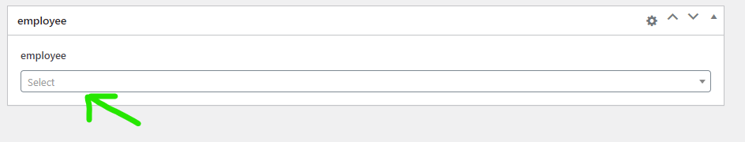
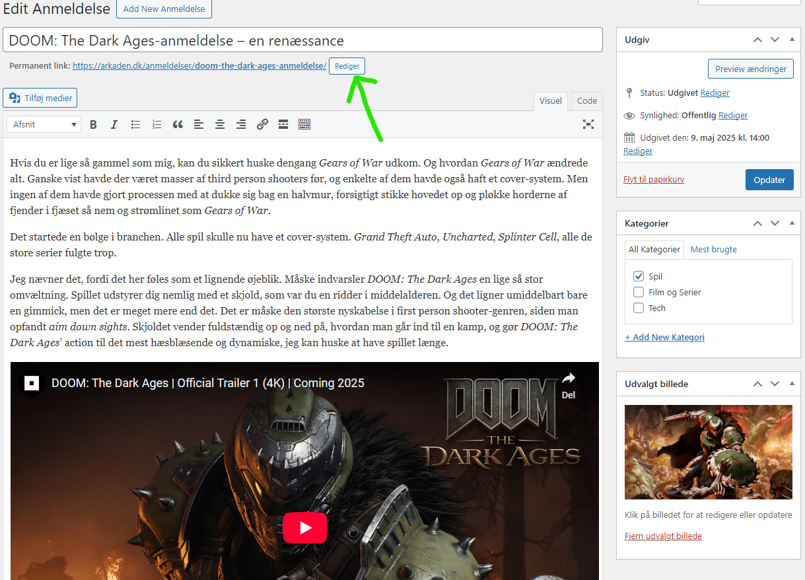

*[Tilbage til forsiden](index.html)*

# Tjekliste til når du tilføjer nyheder/artikler til siden
*Sidst opdateret 21-05-2025*

*Ændringer siden sidst: Guiden er opdateret til det nye site. Afsnittet om underrubrik er fjernet, da vi ikke bruger dem mere. **Bemærk især** at der er nye regler for URL'en til anmeldelser!*

Dette er en lille checkliste med punkter, du kan støtte dig til, når du skal lægge en artikel eller nyhed op på websiden. Brug den gerne som et værktøj til at sikre, at du har gjort alt hvad der skal gøres. Alle punkter bliver uddybet nedenfor.

Husk, at du altid har mulighed for at trykke "gem som kladde" ("Save draft"). Brug den gerne flittigt, da den også gør forhåndsvisninger mere pålidelige.

Guiden her forudsætter, at du skriver dine tekster i et eksternt program som fx Word, Google Docs, LibreOffice eller hvad de nu alt sammen hedder. Dels er det noget lettere at arbejde med en at forfatte direkte i WP, dels er det altid godt med automatisk stavekontrol. 

✅ Læs din tekst igennem for stave- og slåfejl  
✅ Sæt overskrift ind i WP  
✅ Sæt din artikel ind i WP  
✅ Indsæt relevante links i teksten  
✅ Indsæt evt Tweets, Youtube-videoer mv  
✅ Vælg den rette kategori  
✅ Tilføj et "udvalgt billede"  *(her er nyt!)*  
✅ For anmeldelser: ret URL til *(her er nyt! **Vigtigt!**)*  🚨  
✅ Læs det hele igennem en sidste gang  
✅ Gem kladde og publicer

## Læs din tekst igennem for stave- og slåfejl
Word og lignende programmer kan fange meget, men langt fra alt. Stavekontrol er elendig til at spotte manglende ord, for eksempel. Så læs din tekst igennem fra ende til anden, inden du går i gang med at overføre den til WP. Læs, ikke skimme.

## Sæt overskrift ind i WP
Overskriften (eller rubrikken, hvis vi skal tale journalistsprog) giver mere eller mindre sig selv. På det nye site har den fået sin egen dedikerede boks.

## Sæt din artikel ind i WP
Kopier selve artikel-teksten ind. Det i det store felt, der har en lille værktøjslinje i toppen.

## Indsæt relevante links i teksten
Så skal brugerne have noget at klikke på! Indsæt henvisninger til de kilder, vi citerer fra, og henvis også meget gerne til andre nyheder og artikler om samme emne, hvis vi har nogen.

Lad linket indgå som en naturlig del af teksten, fx: "På [spillets nyopslåede Steam-side](http://example.com) fremgår det..."

Undgå formuleringer som disse: "Du kan læse mere om spillet [her](http://example.com)"

**Bemærk:** Jeg anbefaler , at du *ikke* indsætter links i dit skriveprogram, da det hurtigt bliver noget rod at kopiere over. Gem i stedet adresserne, du vil tilføje, i Notepad eller lignende, og kopier dem så ind derfra.

## Indsæt evt Tweets, Youtube-videoer mv
Hvis du skriver en nyhed, der omtaler noget nogen har skrevet på Twitter, så skal tweet'et med. Hvis der er kommet en ny trailer eller lignende til et spil, så skal vi have Youtube-versionen med.

Det er heldigvis nemt: Du åbner det relevante tweet/video/whatever i din browser, og kopierer linket oppe fra browserens adresselinje. Herefter indsætter du det på en ny linje det sted i teksten, du vil have at den optræder.

WP finder selv ud af resten. Du behøver ikke rode med indlejring eller andet. Bare ren copy/paste, som ville du dele et link på Facebook eller i en email eller lignende.

Bemærk dog, at WordPress ikke kan finde ud af links til X. Men skifter du "x.com" ud med "twitter.com", inden du indsætter linket, plejer det at virke. 

## Tilføj skribentprofil
Nederst på redigeringssiden er der en boks, der hedder "employee". Den styrer, hvem der bliver vist som forfatter af artiklen/nyheden. Det vil som regel være dit eget navn, du skal finde her 😅 Tryk på feltet, scroll ned til dit navn eller søg det frem, og vælg det.

Denne funktion indsætter både byline i starten af artiklen, og forfatterprofil i bunden.

## Vælg den rette kategori
De næste mange punkter foregår alle i sidebar'en til højre på siden. 

På det nye site har vi en langt mere stringent opdeling af artikeltyper, så alt ikke længere bare er et "indlæg". Det gør heldigvis også kategorierne meget nemmere at overskue.

For spilnyheder skal du ofte vælge kategorien "gaming". Kategorierne "Nintendo", "PlayStation" og "Xbox" skal kun bruges, hvis nyheden specifikt handler om den pågældende platform eller firmaerne bag. *"Indiana Jones er på vej til PS5"* er en PlayStation-nyhed. *"EA Sports FC 27 annonceret til alle konsoller"* er ikke.

## Tilføj et "udvalgt billede"
Det udvalgte billede er det, der både vises øverst i artiklen under overskriften, og i alle sammenhænge ude på forsiden.

Du kan søge i databasen og vælge et egnet billede. Og hvis her ikke er et, så må du ud på [Google Image Search](https://images.google.com/) og lede. Et tip er, at bruge knappen "Værktøj", når resultatere er kommet frem, til begrænse søgningen til store billeder. Vælg et resultat, højreklik på den nye thumbnail der kommer frem, og sig "åben i ny fane". Vurdér om det er godt nok, og gem det på din computer, så du kan uploade.

*Hvis* du uploader, så **HUSK** at give billedet en fornuftig titel, og evt. også en beskrivelse. Det hjælper MEGET med at søge det frem igen senere! Som *minimum* skal titlen indeholde spillet/filmen/produktets fulde navn, så andre kan finde det. Du kan evt. omdøbe filen inden du uploader, da filnavnet som udgangspunkt bliver indsat som titel.

***Nyt:*** Vi skal altid kreditere hvem vi har billedet fra/hvem det tilhører, og evt fotografen der har taget det - det gælder også for officielle screenshots, pressebilleder mv. Det gøres i feltet *"Featured image source"*, lige under det store tekstfelt.

På det nye site skal vi også selv skrive "Foto:"

Eksempler:
>Foto: Ghost Ship Games
>Foto: 20th Century Films
>Foto: Morten Jensen

## Ved anmeldelser: ret URL til
Af hensyn til SEO vil vi gerne have, at selve web-adressen til vores anmeldelser følger et bestemt mønster. ~~Derfor skal URL-feltet rettes til, så det følger mønsteret *spil-titel-anmeldelse* - og ikke mere end det. Undertitlen i overskriften skal skæres fra her. For eksempel:~~

🚨🚨🚨 **Bemærk! Ny procedure!**

På det nye site bliver ordet "anmeldelse" automatisk sat ind i URL'en, da anmeldelser nu er sin helt egen teksttype.

Vi skal dog stadig rette til, så anmeldelsens undertitel ikke er med i URL'en. I stedet skal der kun stå spillets titel, med små bogstaver, "-" i stedet for mellemrum og ingen koloner eller andet.

Eksempler:  
>doom-the-dark-ages  
>commandos-origins  
>reservatet  

Det giver fine links som fx  
[https://arkaden.dk/anmeldelser/doom-the-dark-ages/](https://arkaden.dk/anmeldelser/doom-the-dark-ages/)  
[https://arkaden.dk/anmeldelser/commandos-origins/](https://arkaden.dk/anmeldelser/commandos-origins/)  
[https://arkaden.dk/anmeldelser/reservatet/](https://arkaden.dk/anmeldelser/reservatet/)  

Du finder knappen til at ændre URL'en ude lige under feltet til overskriften.

## Læs det hele igennem en sidste gang
Nu hvor du har været alt det ovenstående igennem, er dine øjne friske. Så giv lige teksten en sidste hurtig gennemlæsning. Det kan jo være, du har overset noget. 

Gem gerne som kladde og brug forhåndsvisningen, så du er sikker på at det ser rigtigt ud, inden du publicerer.

## Gem kladde og publicer
**Inden du udgiver** *skal* du trykke "Gem kladde". Ellers får din nyhed/artikel en mærkelig URL, hvor overskriften ikke er med, og som bare består af "arkaden.dk" og nogle tal.

Derfor! Tryk "Gem kladde"! Også selvom din historie er klar til offentliggørelse.

Herefter trykker du på den blå knap. Vupti, din historie er live!

Hvis du sidder med en anmeldelse, der først skal udkomme senere, kan du indstille et tidspunkt på planlægge udgivelsen i fremtiden. Tryk på "Rediger" ud for linjen "Udgiv med det samme" og vælg et tidspunkt.

 

På det nye site opdateres forsiden automatisk. Du skal *ikke* bruge afkrydsningsfeltet "Skal postet fremhæves på forsiden?" - det er kun til chefredaktøren.

*[Tilbage til forsiden](index.html)*