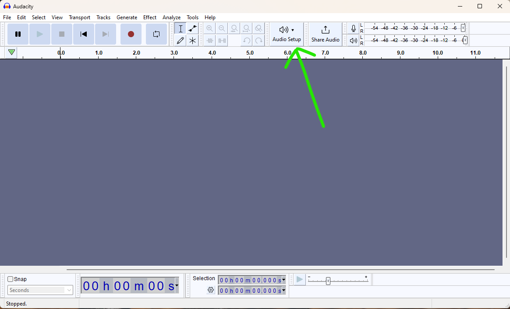
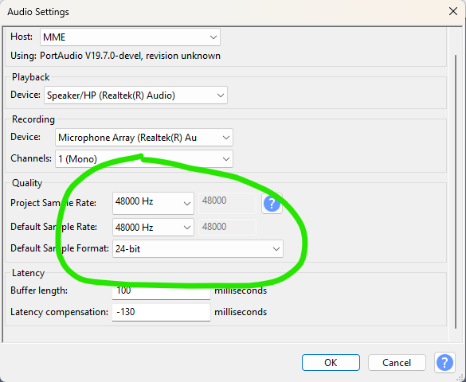
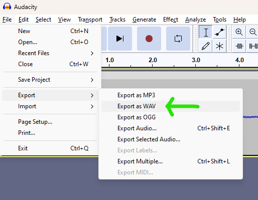
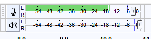
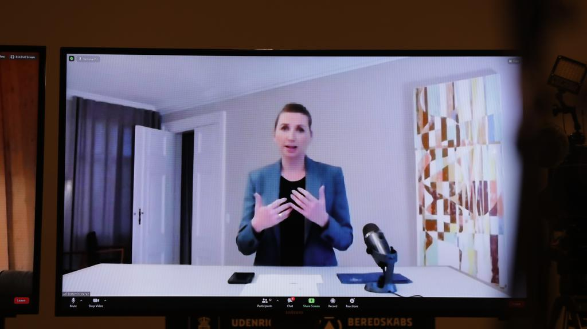

# Tips til at optage lyd/speaks
Her er en stribe tips til at få det bedst mulige resultat, når du skal indtale din tekst til videoanmeldelser og des lige. Som en ekstra bonus gælder de fleste tips også, hvis du skal være med i podcasten

## Hvad skal jeg optage i?

Hvis du mangler et program til at optage lyd i, kan du hente [Audacity](https://www.audacityteam.org/download/). Det er gratis og hæderligt og kan det, du skal bruge. 

Hvis du allerede er hærdet hjemmemusiker og har en DAW, du foretrækker, så bruger du bare den i stedet.

## Hvilke indstillinger og filformater skal jeg bruge?

Sæt Audacity til at optage i 24 bit kvalitet og 48000 Hz. Der er en stor knap i værktøjsbjælken med ordene "Audio Setup" og billede af en højtaler. Klik på den og vælg "Audio settings".

Hvis dit udstyr af en eller anden grund ikke understøtter 24 bit, må du nøjedes med at vælge 16 bit. Undgå 32 bit, selv hvis det er tilgængeligt - det giver bare mere arbejde til klipperen.

Gem din optagelse i almindeligt WAV. Det gøres i menuen File, derefter Export, og så "Export as WAV".

Du skal ikke lave noget efterbehandling, inden du sender filen videre. Al den slags ordner Mikkel. Send ham bare den rå fil.

## Indstil din input-lydstyrke/gain korrekt
Inden du begynder at optage, skal du have indstillet "lydstyrken" på din mikrofon korrekt - det, som fagfolk kalder "gain".

Den rigtige indstilling afhænger både af hvor følsom din mikrofon er, og hvor højt du taler. Heldigvis har vi nogle værktøjer, der kan hjælpe os.

Værktøjsbjælken i Audacity har et par målere længst ude til højre. Klik på ikonet med mikrofonen, og klik på "Start monitoring". Og begynd så at snakke i dit normale stemmeleje.

Når du taler, skal måleren gerne ligge et sted mellem -18 og -12, sådan cirka. Ligger den der, burde du få et godt og brugbart signal, samtidig med at der er "luft" nok foroven til at optagelsen ikke overstyrer, hvis du kommer til at hæve stemmen.

Rigtig mange mikrofoner har en "gain"-knap. Justér på den, mens du taler, så måleren kommer til at ligge cirka mellem -18 og -12. Hvis din mikrofon ikke har en knap til gain, er der en slider på måleren i Audacity, du kan trække i. Men brug mikrofonens gain-knap først, hvis der er en.

## Fjern støj fra omgivelserne, inden du optager
Luk døre og vinduer. Sluk for alt hvad der har en blæser eller står og summer, hvis du kan. Send ungerne ud at lege eller vent til de sover.

De fleste af os siddder nok med stationære computere, men bruger du en bærbar, så tag den med ind i det mest stille og polstrede lokale i dit hjem og optag dér.

Der er også et gammelt trick blandt radiofolk, speakere og hjemmemusikere, nemlig at optage i sæt klædeskab eller garderobeskab. Alt tøjet og stoffet giver en dejlig lyddæmpning, så du undgår rumklang.

Undgå så vidt muligt lokaler med mange hårde overflader og megen rumklang, hvis du kan.

## Afstand til mikrofonen
Det er vigtigt at have mikrofonen i den rette afstand. Er den for langt væk, vil den opfange for meget rumklang fra lokalet og andre støjkilder. Er den for tæt på, kan din stemme blive meget (og unaturligt) bas-tung, hvilket som regel ikke er det man ønsker.

En afstand på omkring 15 centimeter er godt. Det svarer cirka til højden på de fleste smartphones. Så hvis din telefon *lige* kan være mellem din mund og mikrofonen på den lange led, er du godt på vej.

Mange mikrofoner bliver leveret med et lille bordstativ, og det er ofte for lavt til at få mikrofonen op i en god afstand. Men så snupper du bare et par tykke bøger fra bogreolen og stiller stativet oven på dem.

## Plosiver og popfiltre
Når man udtaler B'er og P'er, kommer der ofte et kraftigt pust luft med. Og når det pust rammer mikrofonen, lyder det ad helvede til.

Hvis der fulgte et popfilter med din mikrofon, så brug det endelig! Et popfilter er et stykke elastisk stof eller skumgummi spændt ud over en lille ramme, der lader lyd slippe igennem men stopper de små vindstød fra munden.

Har du ikke noget popfilter, så fortvivl ej! Man kommer langt med god placering af mikrofonen. I stedet for at have den direkte foran dig, så stil den lidt til siden, cirka i en vinkel på 45 grader, så den peger mod din mundvig. Kig frem mens du taler, og vupti, nu undgår du at alle de grimme plosiver rammer mikrofonen.

## Sørg for at mikrofonen vender den rigtige vej
Det her kan lyde lidt banalt, men tjek at du taler ind i den rigtige ende af mikrofonen. Der findes mange forskellige designs af mikrofoner, og det varierer fra model til model, om man skal tale ind i den fra siden eller fra enden.

De tekniske termer her er "side address" og "end address". 

Tjek manualen, folderen, æsken, eller hvad der nu fulgte med din mikrofon. Eller lav en prøveoptagelse, hvor du vender og drejer mikrofonen undervejs. Det gør en *kæmpe* forskel, hvilken vinkel man taler fra, da de fleste mikrofoner er designet til at afvise lyde fra visse vinkler (i hvert fald i nogen grad).

Se dette billede af vores statsminister, der prøver at holde en vigtig tale fra corona-isolation. ALT er galt. Mikrofonen er alt for langt væk, og den peger gudhjælpemig også den forkerte vej. I denne vinkel fanger den mest af alt den lyd, der reflekterer fra skrivebordet...

## Smaskelyde
De fleste af os laver små smaskelyde fra læber og tunge, når vi taler. De kan desværre lyde meget fremtrædende, når man taler. 

Det kan hjælpe at drikke en tår vand, inden du optager. De kloge siger at æblejuice skulle være endnu bedre, og det kan også hjælpe at spise et æble forinden, helst af sorten Granny Smith.

Mælk og kaffe er til gengæld det værste, du kan drikke forinden. Undgå dem gerne i en times tid før du optager.

## Jeg kan ikke lide at læse, har du en video?

Youtube-kanalen Podcastage har en video med tips, der dækker mange af de samme pointer.

<iframe width="560" height="315" src="https://www.youtube.com/embed/Ty8YLqOmbV4?si=vN7sCEtpdNXpP5FE" title="YouTube video player" frameborder="0" allow="accelerometer; autoplay; clipboard-write; encrypted-media; gyroscope; picture-in-picture; web-share" allowfullscreen></iframe><