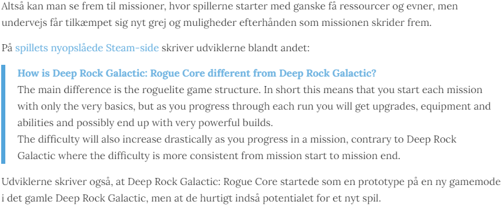

*[Tilbage til forsiden](index.html)*
# Stilguide v0.3
*Sidst opdateret 17-02-2024*

Ændringer siden sidst: Tilføjet retningslinjer for brug af talestreger ved citater.
## Indhold
- Navne på personer
- Titler på spil, film, mv
   - Romertal eller titalssystemet?
- Overskrifter
- Citater *(Her er nyt!)*
- Links
- Tal og numre
- Forkortelser
   - Konsoller og platforme

## Navne på personer
Første gang en person omtales i en tekst, bruges vedkommendes fulde navn. Herefter omtales personen med efternavn:

>Phil Spencer udfordrede i dag Sony-chefen Jim Ryan til MMA-boksekamp. Udfordringen kom i en YouTube-video, hvor Spencer kalder Ryan for "en gammel nisse."

Ingen regel uden undtagelser. Hvis vi omtaler andre redaktionsmedlemmer, kan vi godt være mere afslappede, og i mange tilfælde endda nøjes med kun at bruge fornavne:

>I det seneste afsnit af Arkaden taler Morten og Nikolaj om det overraskende resultat af boksekampen mellem Jim Ryan og Phil Spencer, og Mikkel beder Morten om at holde kæft.

Med YouTubere og andre internetpersonligheder, esportsstjerner m.m. kan vi også holde os til deres kaldenavne. Brug dog gerne det fulde navn samt kaldenavn ved første omtale, hvis det ellers er tilgængeligt og alment kendt.

>Holdets kaptajn har i mange år været Casper ‘cadiaN’ Møller, som er kendt for... [...] Selv havde både cadiaN og Heroic meldt ud, at de blot ville...

## Titler på spil, film, mv
Vi skriver titler på spil, film, bøger osv. med *kursiv*. Ingen anførselstegn eller andet. Overskrifter, mellem- og undrrubrikker og den slags er undtaget.

>En Bethesda-veteran siger, at *Fallout 76*’s vanskelige lancering var et resultat af virksomhedens “hybris”.

### Romertal eller titalssytemet?
Der findes utroligt mange spil, der er efterfølgere, og dermed har tal i navnet. Vi følger den nummerering som udgiveren selv benytter, hvad end det så er romertal eller almindelig titalssystem (1, 2, 3 osv). Vær derfor særligt opmærksom på hvordan udgiveren selv betegner spillet. Er du i tvivl, så google efter coverart eller lignende.

>*Marvel's Spider-Man 2*, *Baldur's Gate 3*, *Overwatch 2*, *Diablo IV*, *Final Fantasy XVI*, *The Elder Scrolls VI*

Og vi siger tak til Activision og deres beslutning om at navngive de nye *Call of Duty: Modern Warfare*-remakes med romertal, så man er nødt til at skelne *Call of Duty: Modern Warfare 2* fra *Call of Duty: Modern Warfare II*, for det er jo ikke spor besværligt, nej.

## Overskrifter
Til nogle artikelformater/tekstgenrer bruger vi overskrifter, der følger et bestemt format.

**Anmeldelser**: Start overskriften med "(spillets titel)-anmeldelse -" og så fængende undertitel. For eksempel:

>Alan Wake II-anmeldelse - Et dyk ned i en forfatters manifesterede mareridt  
>Gargoyles Remastered-anmeldelse - En nostalgisk fælde!  
>Assassin's Creed: Mirage-anmeldelse - et nødvendigt skridt tilbage, men kun et lille skridt frem

Husk bindestreget mellem sidste ord i spillets titel og ordet "anmeldelse". Husk også at ændre URL'en af SEO-hensyn. Se [Tjeklisten for artikler](nyhedstjekliste.html) for mere (dette gælder specifikt for anmeldelser, ikke andre tekster).
## Citater
Hvis vi citerer noget, nogen har sagt i et interview, gør vi det som en del af den almindelige tekst:

>Ifølge Nesmith skyldtes det til dels, at Bethesda var begyndt at hvile på laurbærrene:
>
>“Virksomhedens _scope_ var ikke så fokuseret, som det nok burde have været, og man kunne se resultatet i den måde, det kom ind på markedet på. Vores egen hybris indhentede os til en vis grad.”

Hvis vi citerer fra en skreven tekst - for eksempel en pressemeddelelse, en e-mail, et opslag på sociale medier - indsættes det i stedet som et blokcitat. Indsæt teksten i WP, marker afsnittet og vælg den blok-type der hedder "citat". Resultatet ser således ud:

(Hvis citatet er så kort, at det ikke fylder mere end en enkelt linje eller deromkring, er det ikke nødvendigt at lave blokcitat)

### Tegnsætning omkring citater
Hvis vi citerer et interview fra et andet medie, skal citatet være i citationstegn. Se Nesmith/Bethesda-citatet ovenfor.

Når vi citerer i blokcitat, skal der ikke være citationstegn eller lignende.

***Nyt:*** Hvis vi har interviewet nogen, og det har været ved personligt møde, over telefonen, videochat, i vores pocast etc, og vi citerer deres udtalelser direkte, kan vi bruge *talestreg* eller *replikstreg*.

>– Det ærgrer mig særligt meget, fordi i de 8-10 år jeg har været i branchen, der er vi kommet et stykke ad vejen.

Du kan lade citater som disse stå i et afsnit helt for sig selv. Du kan også tilføje lidt "forfatterstemmer" og præcisere hvem der taler, og evt binde sammen til næste afsnit, hvis det er et længere citat. I så fald skal du være sikker på at det er tydeligt, hvad der er den interviewedes ord, og hvad der er dine:

>– Der manglede fokus på kvindelige gamere, og det ærgrer mig helt vildt, fordi de helt unge piger skal se nogle rollemodeller, der viser at kvinder også gamer, fortæller Marie Watson og forsætter:

Citater skal ***ikke*** skrives med kursiv. Hvis du skriver en interview-artikel, hvor dine spørgsmål også indgår i teksten, kan disse skrives med kursiv.

>*Hvad er det bedste ved at lave spil?*
>
>– At folk oplever noget, du har skabt. Uanset om det er en positiv eller en negativ reaktion, så sætter det aftryk, og det er utroligt fedt.

**Talestreg bruges *kun* når vi selv har lavet interviewet!** Citerer vi et interview fra et andet medie, skal vi stadig bruge citationstegn!

Når du citerer noget fra et udenlandsk medie, er det op til dig, om du vil oversætte det til dansk. Vi kan generelt godt antage, at vores læsere forstår engelsk. Hvis du vælger at oversætte, bør du gøre det konsekvent gennem hele den pågældende tekst.
## Links
Lad gerne links indgå som en naturlig del af en sætning. Både interne såvel som eksterne. Selve link-teksten skal dog helst ikke være for lang.

>I går blev der sat et foreløbigt punktum i en over halvandet år lang saga, da Microsoft endelig kunne [gennemføre deres køb af Activision Blizzard](https://hardwire.dk/microsoft-har-endegyldigt-koebt-activision-blizzard/ "Microsoft har endegyldigt købt Activision Blizzard").

Undgå links som disse:

>❌ Læs vores preview af _Cobalt Core_ [her.](https://hardwire.dk/preview-cobalt-core/)

Gør i stedet sådan her:

> ✅Læs vores [preview af Cobalt Core](https://hardwire.dk/preview-cobalt-core/).

(Hvis der optræder en spiltitel i linkteksten som i eksemplet ovenfor, behøver den ikke være kursiveret - det er for besværligt ellers.)

Når vi henviser til andre medier, kan vi evt nøjes med bare at lade medienavnet være link:

>Det skriver [Gamespot](http://example.com)

## Tal og numre
Tal fra et til ti skreves med talord. Tal fra 11 og op skrives med cifre.

>Et, to, tre... ni, ti. 11, 12, 13... 69, 420, 999

I store tal bruges punktummer som seperator:

>1.500, 10.000 250.000

Med meget store tal kan det hjælpe læseligheden at skrive "millioner" osv i stedet for at skrive tallet ud med cifre, især når det kommer til "pæne" og runde tal. Når antallet af millioner skal benævnes, bruges ovenstående regler stadig.

>To millioner, 150 millioner

## Forkortelser
Det er fint at bruge forkortelser, men første gang en forkortelse benyttes, skal den skrives helt ud, så læseren forstår hvad pokker vi mener.

>Den britiske konkurrencestyrelse, Competition & Markets Authority (CMA), har godkendt Microsofts køb af Activision Blizzard. Godkendelsen kommer direkte fra CMA’s egen mund...

### Konsoller og platforme
Vi bruger følgende forkortelser for de forskellige konsoller og platforme. Vi er så langt inde i den nuværende konsolgeneration, at det ikke er nødvendigt at skelne mellem Xbox One og Xbox Series X og S i almindelig tale.

- PlayStation 5 = PS5
- Xbox Series X og Xbox Series S = Xbox
- Nintendo Switch = Switch

PC kan vi bare kalde PC. I nogle tilfælde kan det dog være nødvendigt at specificere operativsystemer.

>Spillet udkommer til PC, PS5 og Xbox
>
>Spillet udkommer til PC, både på Windows og Linux.

*[Tilbage til forsiden](index.html)*
