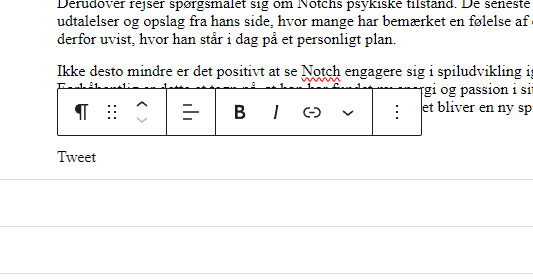
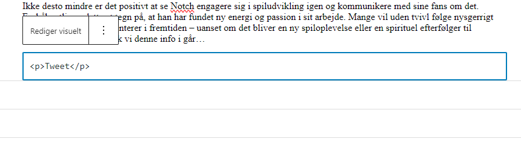

*[Tilbage til forsiden](index.html)*

# Sådan indsætter du tweets  

Selvom Elon Musk er et oversavet røvhul, sker det desværre til tider at der bliver skrevet nyhedsværdige ting på hans affaldsbrand af et socialt medie, Twitter eller hvad det nu hedder.  

Og når det sker, er det praktisk at kunne indlejre tweet'et i en artikel i WP. Tidligere kunne man blot copy-paste URL'en til tweet'et ind i artiklen, men det virker desværre ikke mere. Så her er en grundig guide.  

**Trin 1:** Åben det pågældende tweet for sig selv. Tryk på de tre små prikker øverst til højre i tweetet. Vælg "Indlejr post".  

  
Nu spytter Twitter noget html-kode ud til dig. Kopiér den, så du kan sætte den ind senere.  

**Trin 2:** Hop over i WP. Lav en ny linje i din artikel, der hvor du vil have tweet'et indlejret. Skriv lidt tekst på linjen, så den ikke er tom. Det er ligemeget hvad du skriver, fx "Indsæt tweet her". I billederne nedenfor har jeg bare skrevet "tweet".  

Vent på at den lille WP-værktøjslinje dukker op (hvis den ikke dukker op, kan du trykke med musen på linjen, eller evt markere den midlertidige tekst, du skrev lige før.)  

  
Tryk på de tre lodrette prikker, og vælg punktet "Rediger som HTML" Nu åbner der et tekstfelt med rå HTML-kode.  

  
Slet al teksten i dette felt, og indsæt i stedet den kodestump, vi kopierede fra Twitter i trin 1:  

  
Tryk evt på "Rediger visuelt", når du er færdig, for at lukke HTML-tekstboksen.  

**Trin 3:** Nu skal vi tjekke, at det hele virkede som forventet.  

WP vil sikkert skrive noget i retning af "Denne blok indeholder uventet eller ugyldigt indhold". Den skal du bare ignorere. Den rå tekst fra Tweet'et står sandsynligvis nedenunder.  

Gem din kladde, og lav en forhåndsvisning. Tjek om tweet'et bliver vist korrekt.  

